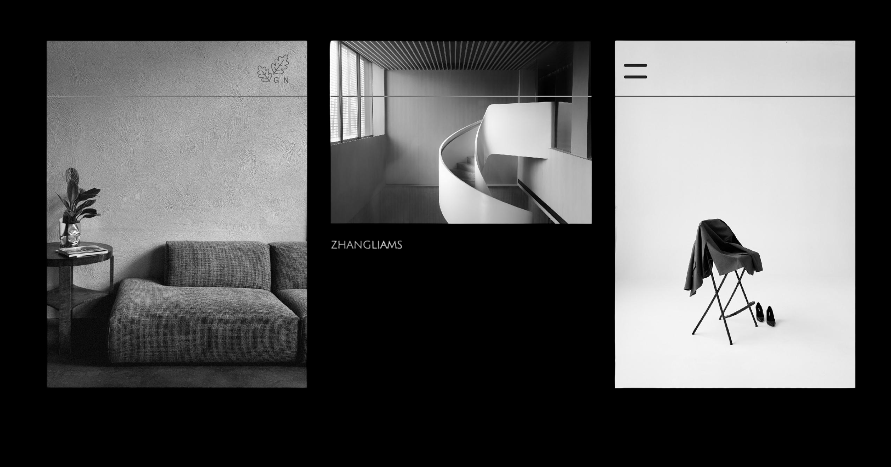

# Galleria Noir

> An elegant dark gallery with infinity scroll

A beautiful photo gallery with a dark theme that creates the illusion of infinite scrolling. Drag around to explore endless photos that loop seamlessly in all directions.

## Design


## ✨ What makes it special

- **Infinite scrolling** - Navigate endlessly in any direction
- **Dark theme** - Elegant black design with smooth animations  
- **Drag navigation** - Click and drag to move around
- **Image categories** - Browse nature, travel, fashion, music, and movies
- **Search** - Find specific photos by keyword
- **Full screen preview** - Click any image to see it large

## 🚀 How to run it

1. **Get a free API key** from [Unsplash](https://unsplash.com/developers)
   - Create an Unsplash account
   - Go to [Unsplash Developers](https://unsplash.com/developers)
   - Create a new application
   - Copy your **Access Key** (not the Secret Key)

2. **Replace the API key** in `index.js` (line 2):
   ```javascript
   const accessKey = 'your-unsplash-access-key-here';
   ```

3. **Open `index.html`** in your browser

That's it! No installation needed.

> **Note**: The Unsplash API provides high-quality, free photos from talented photographers around the world. The free tier includes 50 requests per hour, which is perfect for development and personal use.

## 🎮 How to use

- **Navigate**: Click and drag anywhere to move around
- **Categories**: Click the menu (≡) to browse different photo types
- **Search**: Type any keyword to find specific images
- **Preview**: Click any photo to see it full size
- **Home**: Click the logo to go back to the main view

## 🛠️ Built with

- Vanilla JavaScript
- CSS Grid
- GSAP animations
- Unsplash API

---


## 👨‍💻 Author

**Ayman Soliman**
- Portfolio: [aymansoliman-dev.github.io](https://bento.me/ayman-soliman)
- GitHub: [@aymansoliman-dev](https://github.com/aymansoliman-dev)
- Frontend Mentor: [@aymansoliman-dev](https://www.frontendmentor.io/profile/aymansoliman-dev)
